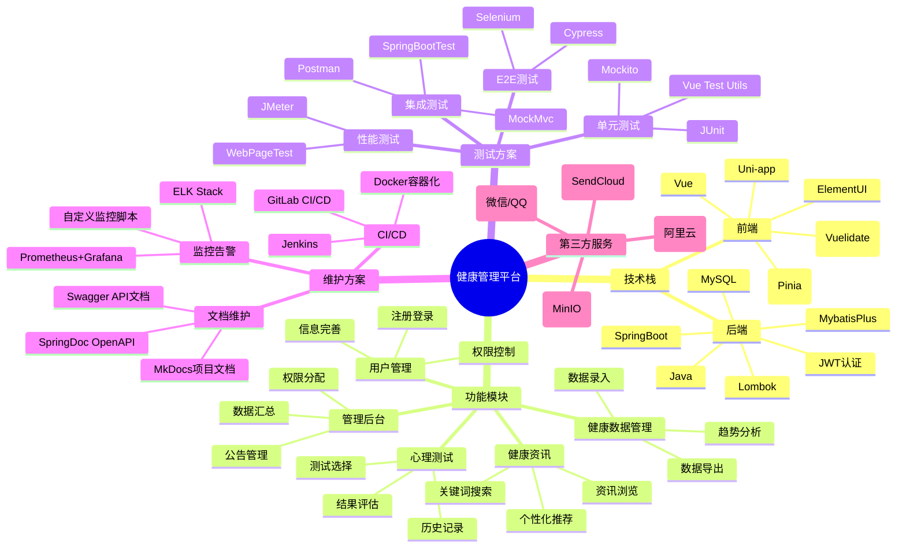

# 校园智能健康管理平台

## 功能介绍
- **健康数据管理**：学生在小程序记录健康数据，系统可视化展示健康趋势。教师可查询、评估学生健康数据，生成健康报告。管理端汇总分析全校健康数据。
- **心理测试与评估**：提供心理测评问卷，评估结果引导学生了解心理状态。教师可创建、管理测试试卷和试题。
- **健康资讯推荐**：学生可检索健康知识，系统推送个性化资讯。管理端发布和管理健康资讯。
- **用户管理与权限控制**：实现用户注册、登录、权限管理，保障数据安全。
- **公告与通知管理**：管理端和教师端发布公告、通知，系统推送信息给学生。

## 技术栈
- **前端**：Vue、ElementUI、Uni-app
- **后端**：Java、SpringBoot、MybatisPlus
- **数据库**：MySQL

## 应用场景
- **校园健康管理**：为学生、教师和管理人员提供健康管理服务，提升校园健康水平和心理健康教育质量。

## 项目目标
- **提升健康管理效率**：通过信息化手段实现健康数据的实时收集和动态分析。
- **促进心理健康教育**：帮助学生了解心理状态，为教师提供心理健康教育工具。
- **推动数字化转型**：为教育行业的健康管理提供借鉴，推动数字化转型。

## 小组成员及分工

| 姓名                                | 学号         | 分工                     |
| ----------------------------------- | ------------ | ------------------------ |
| [郭欣凯]() | 2212190226 | 前端    |
| [李健彰]() | 2212190512 | 后端    |

# 校园智能健康管理平台

## 项目结构

# 校园智能健康管理平台项目计划

| 阶段         | 任务               | 开始时间   | 结束时间   | 持续时间 |
|--------------|--------------------|------------|------------|----------|
| 需求与设计   | 需求调研           | 2025-04-12 | 2025-04-18 | 7 天     |
| 需求与设计   | 概念设计           | 2025-04-19 | 2025-04-23 | 5 天     |
| 需求与设计   | UI原型设计         | 2025-04-24 | 2025-05-03 | 10 天    |
| 基础架构     | 前端环境搭建       | 2025-05-04 | 2025-05-08 | 5 天     |
| 基础架构     | 后端环境搭建       | 2025-05-04 | 2025-05-10 | 7 天     |
| 基础架构     | 数据库设计         | 2025-05-11 | 2025-05-15 | 5 天     |
| 核心功能开发 | 用户模块开发       | 2025-05-16 | 2025-05-25 | 10 天    |
| 核心功能开发 | 健康数据模块开发   | 2025-05-26 | 2025-06-08 | 14 天    |
| 核心功能开发 | 心理测试模块开发   | 2025-06-09 | 2025-06-18 | 10 天    |
| 扩展功能     | 健康资讯模块开发   | 2025-06-19 | 2025-06-25 | 7 天     |
| 测试验证     | 单元测试           | 2025-06-26 | 2025-06-30 | 5 天     |
