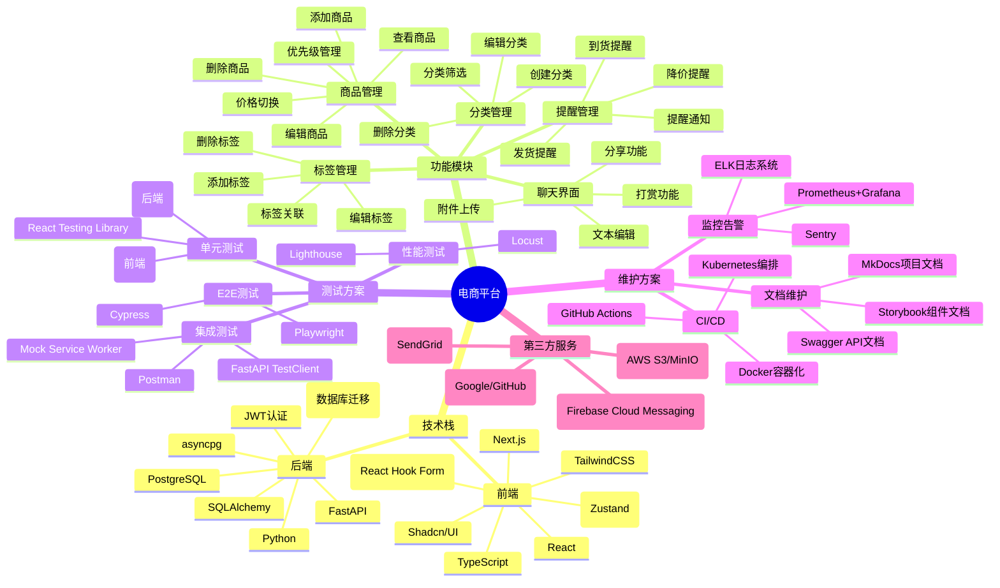
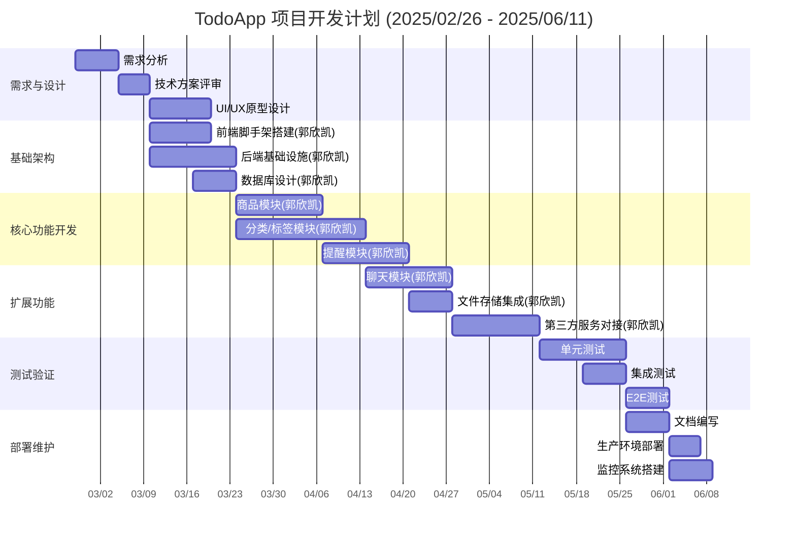

# TodoApp

## 项目介绍

本项目是一个基于React+Next.js+TailwindCSS+TypeScript+Shadcn/UI的移动电商APP，后端使用Python+FastAPI。其主要功能是：

- 添加、编辑、删除、查看产品
- 添加、编辑、删除、查看产品分类
- 添加、编辑、删除、查看产品标签
- 购买和出售产品
- 买卖家的交流

## 小组成员及分工

| 姓名                                | 学号         | 分工                     |
| ----------------------------------- | ------------ | ------------------------ |
| [郭欣凯]() | 2212190226 | 全部    |

## 项目结构

## 项目计划

