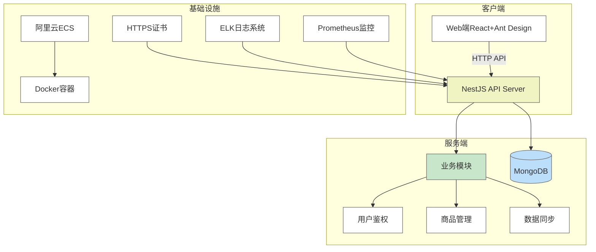

# 系统架构

## 技术栈选择依据：

1. **前端**：
   - **Html**：TypeScript支持、模块化架构、集成Swagger文档
   - **Css**：灵活存储Todo数据结构（支持标签/分类/时间戳）
   - **Js**：缓存高频访问的Todo列表数据
   - **Vue**：结合微信UnionID实现跨端用户体系
   - **Element-ui**：结合微信UnionID实现跨端用户体系

2. **后端**：
   - **Java**：函数组件+Hooks开发模式
   - **Spring Boot**：企业级UI组件库（Table/Form/Calendar）
   - **MyBatis**：轻量级状态管理

3. **数据库**：
   - **Mysql**：复用Web业务逻辑（共享TypeScript类型定义）

## 关键架构设计：

1. **数据同步方案**：

2. **微信登录流程**：

3. **项目环境**：
   - **环境配置**：JDK1.8+Maven+Mysql8+npm
   - **架构模式**： MVC、前后端分离
   - **开发工具**：IDEA|eclipse、Vscode
   - **数据库版本**：Mysql8.0/Mysql5.7
   - **数据库可视化工具**: Navicat
   - **前端Nodejs**: 14|16

