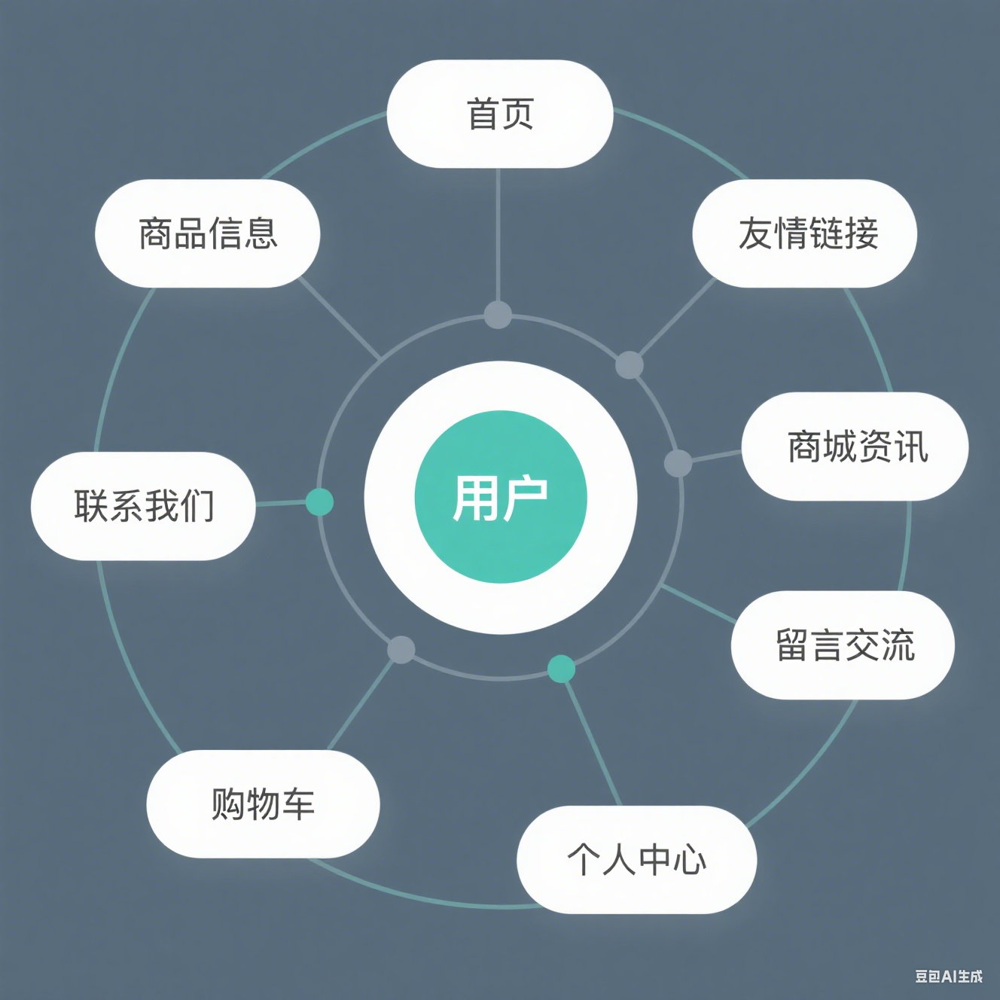
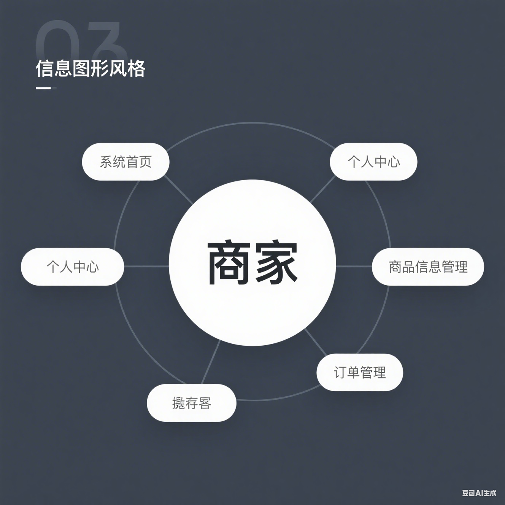
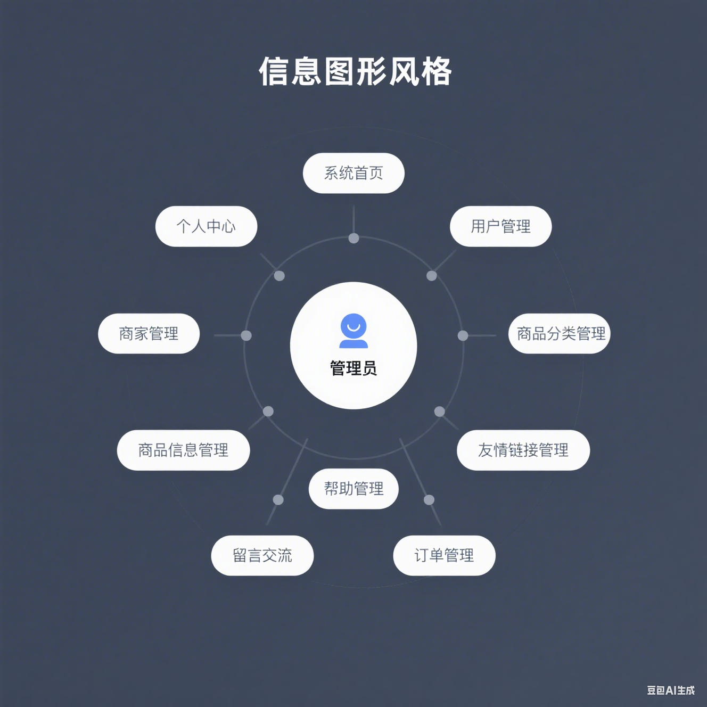

# 系统架构

## 技术栈选择依据：

1. **前端**：
   - **Html**：通过各种标签定义网页的元素和内容布局，使网页能够在浏览器中正确显示。
   - **Css**：定义元素的样式（如颜色、字体、间距等）来美化网页并提升用户体验。
   - **Js**：实现网页的交互功能使网页从静态变为动态。
   - **Vue**：通过声明式的数据绑定和组件系统，简化开发流程，提升开发效率和用户体验。
   - **Element-ui**：提供丰富且美观的组件，高效构建现代化的前端项目。

2. **后端**：
   - **Java**：跨平台性、强大的内存管理和垃圾回收机制、丰富的类库支持以及良好的安全性和多线程特性，适合使用
   - **Spring Boot**：简化了基于 Spring 框架的开发，通过自动配置和依赖管理，快速搭建独立、生产级的基于 Spring 框架的应用程序
   - **MyBatis**：能够将 SQL 映射到 Java 对象，同时支持动态 SQL 语句

3. **数据库**：
   - **Mysql**：具有高性能、高可用性、易用性、良好的可扩展性和强大的社区支持，适合各种规模的应用场景，广泛应用于企业级应用和互联网项目。

## 项目结构设计：

1. **各方权限**：

   
   
   

3. **全流程**：
   

4. **项目环境**：
   - **环境配置**：JDK1.8+Maven+Mysql8+npm
   - **架构模式**： MVC、前后端分离
   - **开发工具**：IDEA|eclipse、Vscode
   - **数据库版本**：Mysql8.0/Mysql5.7
   - **数据库可视化工具**: Navicat
   - **前端Nodejs**: 14|16

