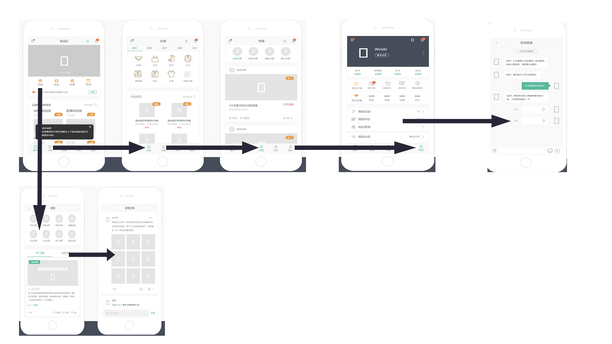
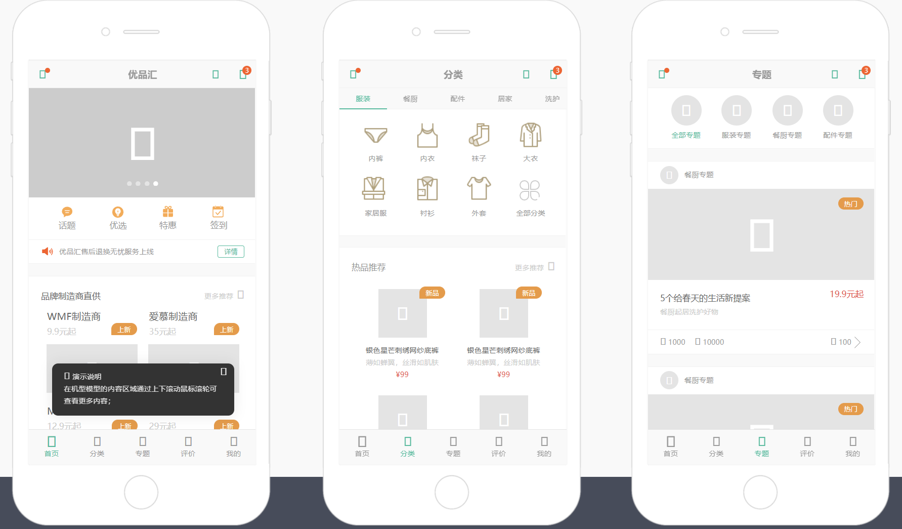
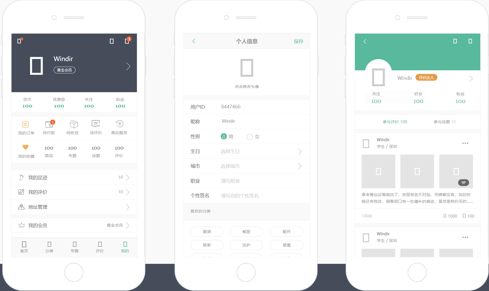
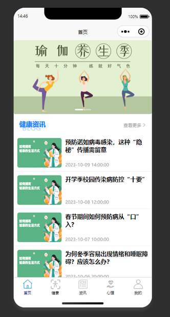
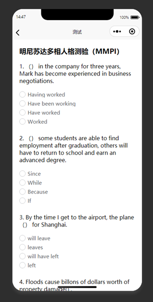
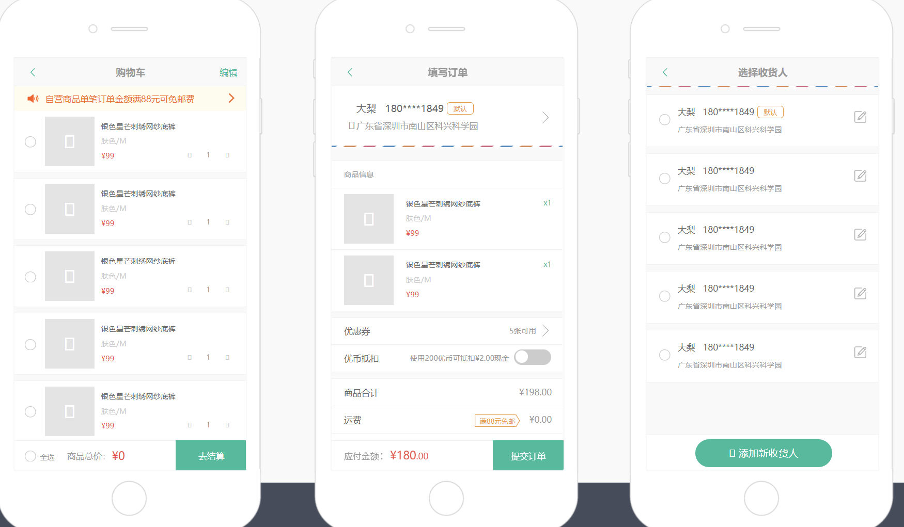
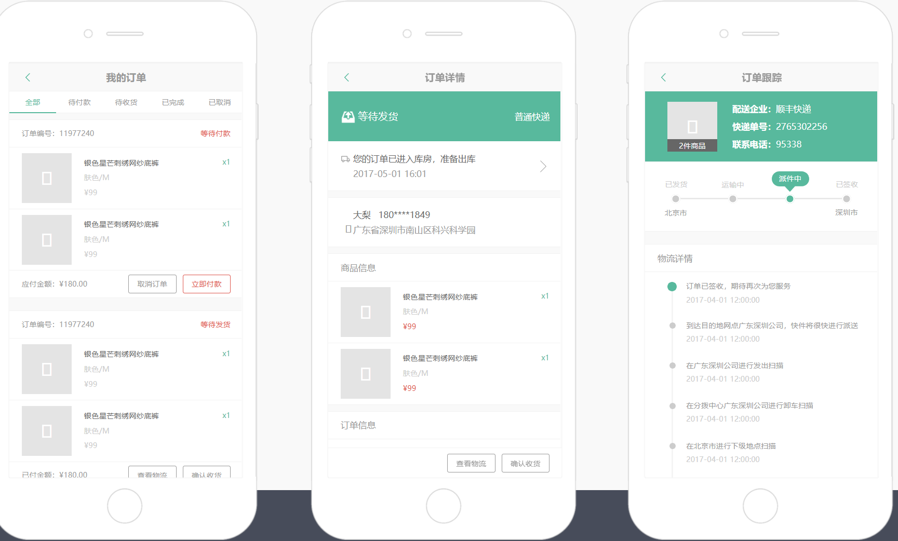
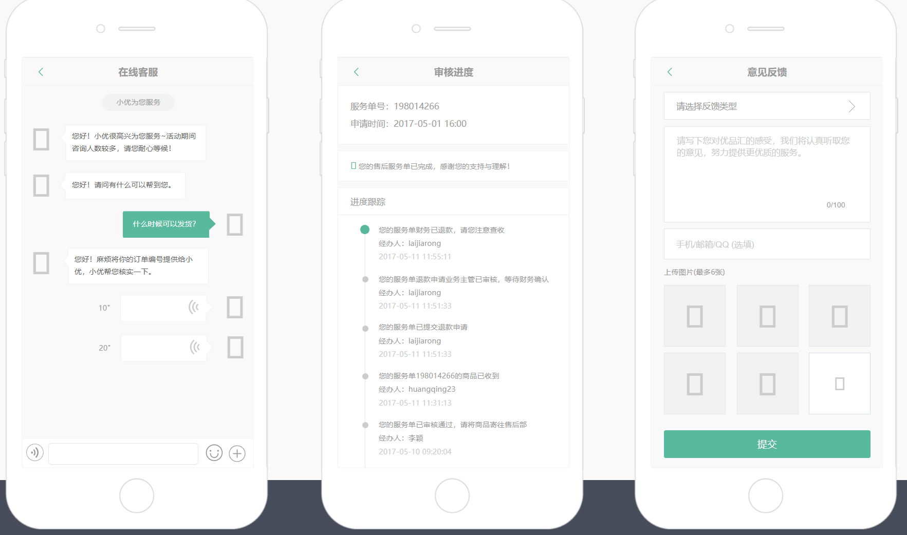

# UI/UX 设计

> [!CAUTION]
> 这里除了图片外还应当对每幅图进行文字说明。

## 概念设计

>仿造淘宝平台设计的简易电商平台，账号登陆后进入主页，通过主页快捷键可进入包括分类、品牌专区、专题等四个专属模块，大数据化你的购物喜好。看到喜欢的商品可以点进去查看大图、购买和加入购物车。还可以进入消息界面与客服咨询相关内容、查看个人主页。

## 网站(App)地图

## 线框图

## 风格规范

## UI 设计
>主要功能

>用户中心

>会员体系

>社区体系

>内容推荐

>订单流程

>订单管理

>售后及服务

