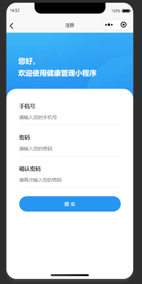
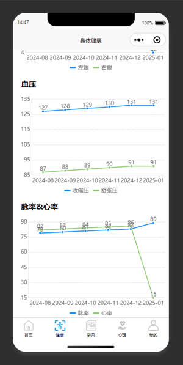

# UI/UX 设计

> [!CAUTION]
> 这里除了图片外还应当对每幅图进行文字说明。

## 概念设计

>仿造淘宝平台设计的简易电商平台，账号登陆后进入主页，通过主页快捷键可进入包括分类、品牌专区、专题等四个专属模块，大数据化你的购物喜好。看到喜欢的商品可以点进去查看大图、购买和加入购物车。还可以进入消息界面与客服咨询相关内容、查看个人主页。

## 网站(App)地图

## 线框图

## 风格规范

>APP页面：375*667px

Web尺寸：1260*1024px

顶部状态栏：20px

顶部导航栏高度：44px

底部导航栏高度：48px

一般字号：12px-14px

原型图元素采用：黑，白，蓝三个颜色

## UI 设计
>登录

>健康数据记录

>数据分析

>健康资讯推荐

>心理测试

